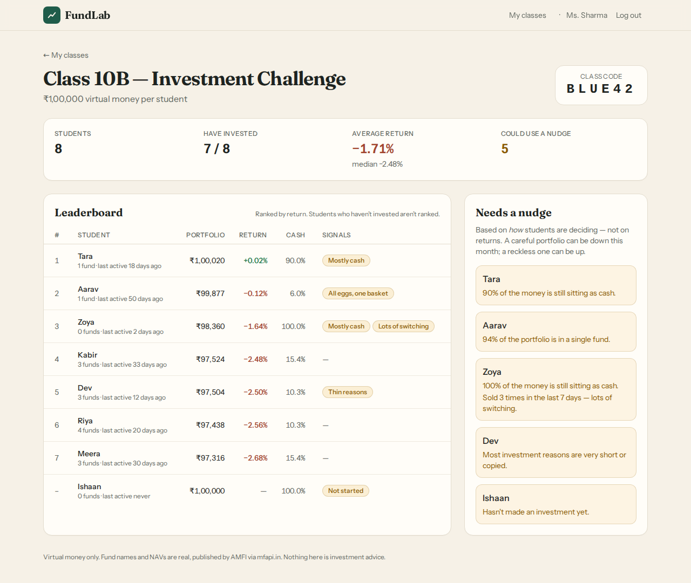
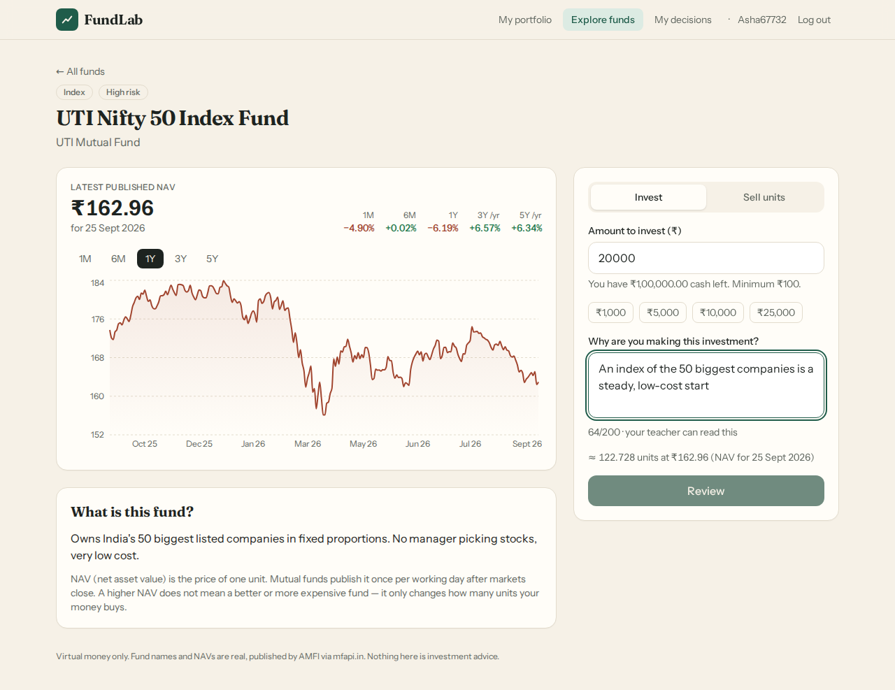

# FundLab

**Real funds. Virtual money. Better first mistakes.**

FundLab is a classroom mutual-fund simulator:

1. A teacher creates a class and chooses a starting corpus.
2. Every student joins with a class code and gets exactly that much virtual money.
3. Students invest it in **real Indian mutual funds at their real published NAVs**, and must say *why* before every purchase.
4. The teacher sees who is leading and, separately, who needs a nudge. The nudges are based on *how* each student is deciding, not on this month's returns.

No real money is ever involved.

| Teacher dashboard | Student fund page |
|---|---|
|  |  |

---

## What I built

**Teacher**
- Sign up, create classes, and pick the starting money. The corpus is fixed once set, so everyone stays equal.
- Get a 6-character class code (no ambiguous characters like 0/O or 1/I).
- **Dashboard:**
  - participation, class average and median return;
  - a leaderboard ranked by return, where students who haven't invested are listed but not ranked;
  - a **Needs a Nudge** panel: not started, concentrated in one fund, thin or copy-pasted reasons, mostly cash, frequent switching.
- **Student detail:** holdings, and every buy and sell with the NAV used, its date, and the student's reason.
- Issue a new PIN for a student who is locked out. This also signs out any old sessions.

**Student**
- Join with class code and a first name. No email. You get a 6-digit PIN to log in on other devices.
- Portfolio: value, gain, cash and holdings, plus a daily reflection question.
- Explore 16 curated real funds (Direct, Growth) across 9 categories. Each shows the latest published NAV **with its date**, the 1-year return, risk level and a plain-language description.
- Fund page:
  - NAV history chart (1M–5Y);
  - returns, with 3Y/5Y annualised;
  - a buy flow that requires a reason (10–200 characters) and a review step;
  - sell by units or "sell all".
- "My decisions": an append-only history of every trade and reason.

**Also**
- A read-only **MCP server** (`apps/mcp`) so a teacher can ask an AI assistant things like "who in 10B needs a nudge, and what did Dev write as his reasons?"
- A demo classroom whose trades were back-dated at **real historical NAVs**. Each of its 8 students shows a different pattern for the teacher to spot.

## The money model (the part that matters most)

```
units bought    = amount / NAV              rounded DOWN to 3 dp; full amount debited
sell proceeds   = units × NAV               rounded DOWN to the paisa
cash            = corpus − Σ buys + Σ sells
holding value   = units × latest NAV
portfolio value = cash + Σ holding values
gain            = portfolio value − corpus;   return % = gain / corpus × 100
```

- **No balance is stored anywhere.** Cash, holdings and value are derived from an **immutable trade ledger** plus the latest NAV.
- The database enforces the ledger itself: a trigger blocks `UPDATE` and `DELETE` on trades, and `CHECK` constraints require positive amounts and a reason on every buy.
- Every trade locks the student's row, so parallel requests can't overspend.
- If fund data is unavailable or the NAV is more than 7 days old, the trade is refused and **nothing is recorded**.
- All authoritative maths uses `decimal.js` and Postgres `NUMERIC`, never JavaScript floats.

The formulas live in one place, `apps/api/src/finance/`: pure functions with no I/O and 46 unit tests. The trade path is in `apps/api/src/trading/trading.service.ts`.

## Architecture

```
apps/web  (React 19 + Vite + Tailwind + Recharts)
   │  REST, JWT
apps/api  (NestJS 11)
   ├── finance/     pure money rules, nudges, NAV-date rules    ← unit-tested
   ├── trading/     the only code that writes trades (row lock + ledger replay)
   ├── funds/       FundDataProvider interface → MfapiProvider adapter, NAV cache
   ├── portfolio/   derives valuations from the ledger (shared by student & teacher views)
   ├── classrooms/  teacher routes, ownership checks
   └── auth/        teacher password / student PIN, JWT guard, attempt limiter
   │  Prisma 7 + @prisma/adapter-neon (WebSocket)
Neon Postgres

apps/mcp  (read-only MCP server) ──REST──► apps/api     (no DB access, no business logic)
```

- **Fund data:** [mfapi.in](https://www.mfapi.in/), which republishes AMFI's daily NAV file, behind a `FundDataProvider` interface. Swapping to AMFI directly means writing one adapter.

## Running it

**Requirements:** Node 20+ and a Postgres database (Neon recommended; any Neon connection string works).

```bash
npm install
cp apps/api/.env.example apps/api/.env      # set DATABASE_URL and JWT_SECRET
npm run db:migrate                          # applies prisma/migrations over Neon's WebSocket driver
npm run db:seed                             # verifies the 16 funds live and creates the demo class
npm run dev:api                             # http://localhost:3000/api
npm run dev:web                             # http://localhost:5173 (proxies /api to :3000)
```

**Demo logins**
- **Teacher:** `demo.teacher@fundlab.app` / `fundlab-demo`
- **Student:** class `BLUE42`, name `Riya` (or Aarav, Meera, Kabir, Dev, Zoya, Tara, Ishaan), PIN `246810`

**Start over:** `npm run db:reset -w apps/api -- --yes`. This drops the schema. Trades can't be deleted any other way; that's deliberate.

### Tests

```bash
npm test                                     # 52 unit + 44 API integration tests (apps/api)
cd apps/web && npx playwright install chromium && npx playwright test   # 5 browser journeys (API + web running)
```

- **Integration tests** run against a real database in an isolated `fundlab_test` schema. They use a fake fund-data provider so outages, stale NAVs, NAV changes and concurrent trades are all reproducible. They cover:
  - every money invariant;
  - failing closed;
  - the row lock under parallel buys;
  - teacher/student authorization boundaries, forged tokens and PIN brute-force;
  - the ledger trigger.
- **Browser tests** walk the same path as the screen recording: teacher first, then student.

### MCP server

```bash
npm run build -w apps/mcp
```

Add it to an MCP client (Claude Desktop, Claude Code, …):

```json
{
  "mcpServers": {
    "fundlab": {
      "command": "node",
      "args": ["/absolute/path/to/fundlab/apps/mcp/dist/server.js"],
      "env": {
        "FUNDLAB_API_URL": "http://localhost:3000/api",
        "FUNDLAB_TEACHER_EMAIL": "demo.teacher@fundlab.app",
        "FUNDLAB_TEACHER_PASSWORD": "fundlab-demo"
      }
    }
  }
}
```

**Tools** (all read-only): `list_funds`, `get_fund`, `list_classrooms`, `get_classroom_summary`, `get_student_detail`. There is deliberately no buy/sell tool.

## Deploying

**Not deployed yet**, because this was built without hosting credentials. The path is:

- **Database:** the Neon project is already migrated and seeded.
- **API** (Render, Railway or Fly):
  - build: `npm install && npm run build -w apps/api`
  - start: `npm start -w apps/api`
  - env: `DATABASE_URL`, `JWT_SECRET`, `CORS_ORIGIN=<web URL>`
- **Web** (Vercel or Netlify):
  - root: `apps/web`
  - build: `npm run build`
  - env: `VITE_API_URL=<API URL>`
  - `apps/web/vercel.json` handles SPA routing.

The repo also has `neon.ts` (Neon config policy) and Neon's agent skills under `.claude/`, from the Neon CLI setup.

## Known limitations

- **Trades execute at the latest *published* NAV, not the next one.** A student who sees the market rise today can buy at yesterday's price. Real funds prevent this with cut-off times. This is the biggest simplification; it's documented with the fix in [DECISIONS.md](DECISIONS.md) #1.
- **Nudge thresholds are judgement calls** (60% in one fund, and so on) and aren't teacher-adjustable yet.
- **Login-attempt counters are in memory.** That's correct for one API instance; several would need shared storage.
- **The MCP server logs in with full teacher credentials.** A scoped read-only token would be better.
- **Late joiners face a different market.** Returns are measured from each student's own start.
- **After a trade, a fund's position can show a paisa-level loss** from unit rounding. This is intentional and matches real statements.

## Deliberately left out

- Real money, payments, KYC, broker integration, real orders, SIPs, tax, exit loads.
- Forward pricing and IDCW payouts.
- Risk profiling, AI fund recommendations, chat, notifications, a mobile app, parent accounts, grading, badges and confetti.

The reasoning is in [DECISIONS.md](DECISIONS.md) #11. The short version: none of them helps a fifteen-year-old make and explain an investment decision, and some (AI recommendations, confetti for returns) actively work against it.

---

**Further reading:**
- [DECISIONS.md](DECISIONS.md): the hard calls
- [AI_LOG.md](AI_LOG.md): where AI helped and where it was wrong
- [AGENTS.md](AGENTS.md): the agent workflow used to build this
- [docs/demo-script.md](docs/demo-script.md): screen-recording script
